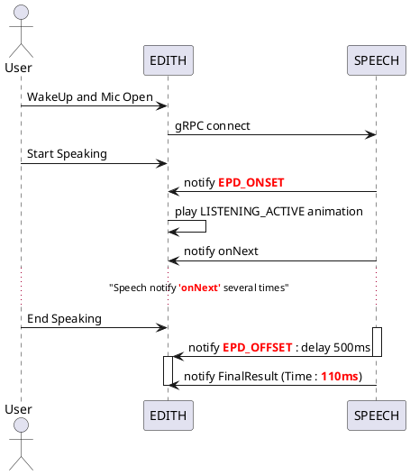

```plantuml
@startuml
actor User
User -> EDITH : WakeUp and Mic Open
EDITH -> SPEECH : gRPC connect
User -> EDITH : Start Speaking
SPEECH -> EDITH : notify <color #red>**EPD_ONSET**</color>
EDITH -> EDITH : play LISTENING_ACTIVE animation

SPEECH -> EDITH : notify onNext
... "Speech notify <color #red>**'onNext'**</color> several times" ...

User -> EDITH : End Speaking

activate SPEECH
SPEECH -> EDITH : notify <color #red>**EPD_OFFSET**</color> : delay 500ms
deactivate SPEECH

activate EDITH
SPEECH -> EDITH : notify FinalResult (Time : <color #red>**110ms**</color>)
deactivate EDITH
@enduml
```